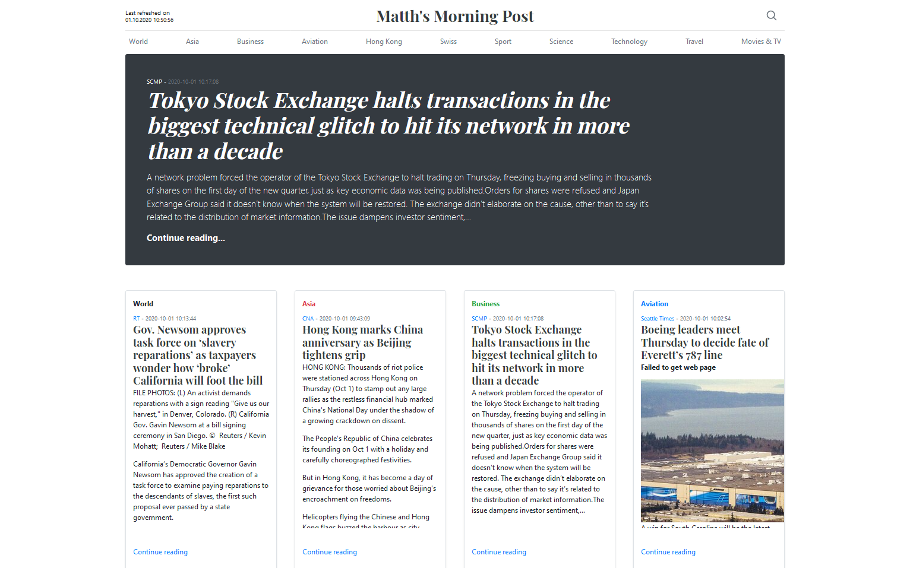
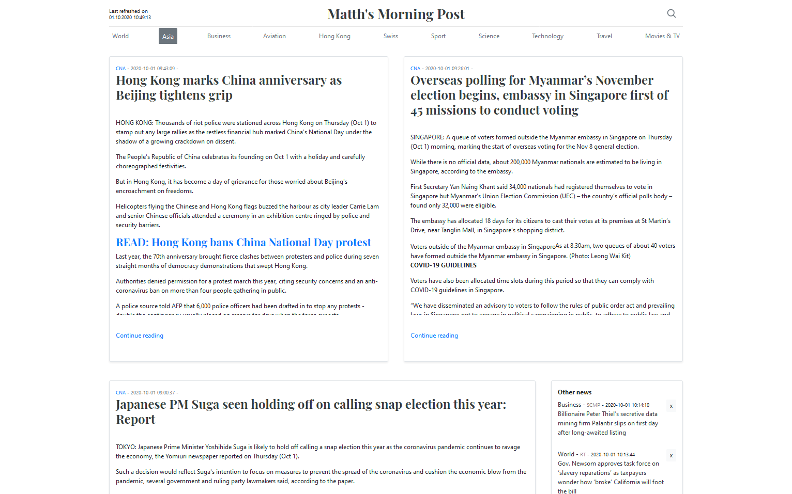
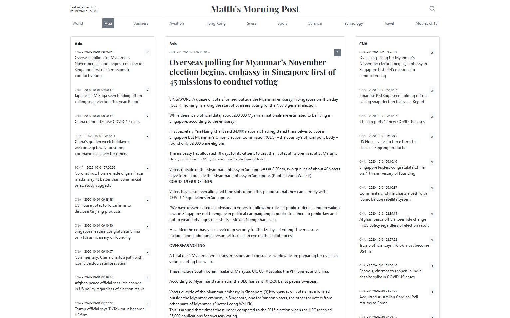

# selfoss - Webfront - V0.9

This is newspaper style webfront for the selfoss RSS reader (https://github.com/fossar/selfoss).

I never liked RSS readers very much as the user interface is just plain ugly. I wanted to have
a nice looking user interface that feels like a newspaper, and not like some technical list. 
And ideally, I wanted to have the full article, and not just a teaser. When I came across selfoss
that can fetch the full article (with some limits), I felt I want to use that as a base for my
personal "Morning Post".

- Website that looks like a newspaper
- Based on Bootstrap blog example (https://getbootstrap.com/docs/4.5/examples/blog/)
- Fixed to 11 categories

## Features

- As it is based on a Bootstrap template, it is responsive and also works quite well on a mobile phone
- Content is mostly refreshed on regular intervals without a need to reload the page (on the main page and the list boxes on the other two pages)
- Articles that have been read are excluded from showing up again, unless the article is "starred". So you don't always see the same 10 news items that you have read already
- An article is automatically marked as read  when you scroll to the end of the article or if it's fully visible, after a set threshold in seconds
- Articles can be marked read (made disappear) with a click on the x in the list boxes
- Articles with the same title are combined and only shown once (based on lowest date). So if a source shows the same item in different feeds it will only be shown once on the page
- Links to the source are opened in a new tab

## Limitations

- The content is displayed as it is in the database. So HTML code and images will be displayed as they are retrieved by selfoss and do "mess-up" the look to a certain extent
- The top lead article will show up again in one of the lower categories, but that is the only item showing up twice
- It currently is fixed to 11 categories or tags
- If a source has multiple tags, only the first is taken into account
- Similar articles from different sources are not combined. So the same topic will show up multiple times

## Screenshots

This is the main page with the overview of the categories/tags. There is a lead article on top, followed by the latest article from the top 8 categories.
Below that follows a list of a number of headlines for these 8 categories. At the bottom follows a full article for the remaining three categories, next to a list of some headlines in that category.

The category page shows the two latest articles on top, followed by a list of headlines with teasers and a list of headlines from other categories.

The article page shows a single article in the middle, while the left hand shows a list of headlines for that category, and the right shows a list of headlines from the same source.

## Installation

0. You need to have selfoss (https://github.com/fossar/selfoss) installed first. Please revert to that installation instructions to get selfoss going first.
1. To keep things clean(er), I suggest to create a separate virtual website on the same (or a different) machine. I have used an nginx webserver and this tutorial on Step 5 shows the basics (https://www.digitalocean.com/community/tutorials/how-to-install-nginx-on-ubuntu-20-04). You might want to set news.php as the index page so it defaults to that page. 
2. Copy the files from the website folder in this repository to your virtual site. Keep the same folder structure.
3. Adjust the settings/variables in the /includes/constants.php file. There are comments in the file. You have to define your database details and also add the 11 categories/tags in the array below. The first column is for the visible category names. These can include spaces, while the second column should avoid spaces or special characters.
4. Enjoy
5. Optional: Add a reverse proxy in front (or open the port) to the virtual website to have access to the newspaper from outside your network. I am using a reverse proxy with personal certificate to secure the site.

## Configuration

1. Define the settings of your database (it's tested for MySql, not sure if other databases will work)
2. Define the name of your "newspaper" and choose the font
3. Define your categories (11 needed)

## Development

Please excuse the spaghetti code. But it does work, so...

## Credits

Thanks to awesome selfoss, as without that this wouldn't be possible. 
And thanks to Stackoverflow and countless other pages/forum to help me get my code done.
